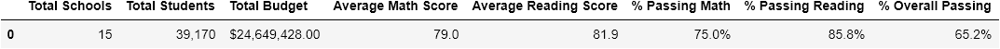
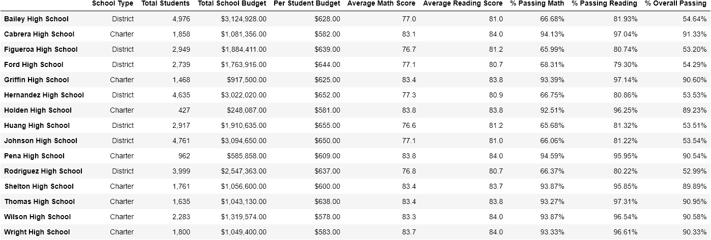
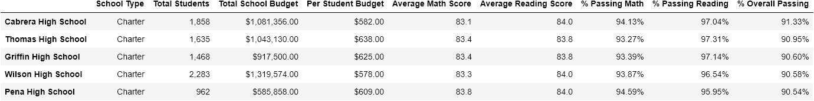
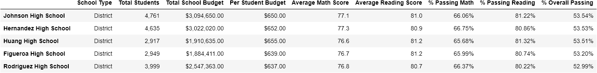
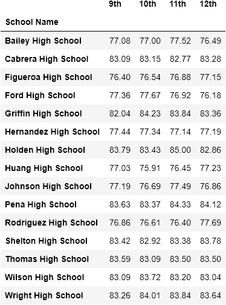
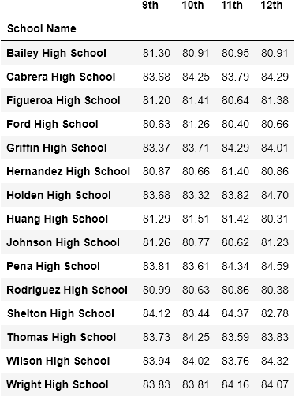
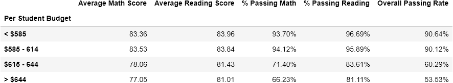
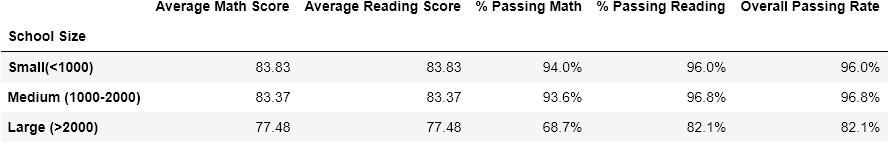
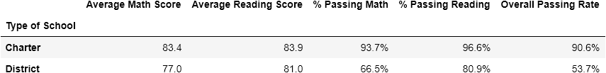

## OBJECTIVE
Analyze the district-wide standardized test results to help the school board and mayor make strategic decisions regarding future school budgets and priorities. You'll be given access to every student's math and reading scores, as well as various information on the schools they attend. 

## FINAL REPORT

### District Summary

### School Summary

### Top Performing Schools (By % Overall Passing)
  
  

### Bottom Performing Schools (By % Overall Passing)

### Math Scores by Grade

### Reading Scores by Grade

### Scores by School Spending

### Scores by School Size

### Scores by School Type

## Overall Observations

### 1. Charter schools had higher test scores than district schools. 
This trend is seen in the top and bottom performing school based on percent of students that passed overall. The top five performing are charter schools and the bottom five are district schools. This trend is corroborated by the scores by school type. While there's less than a six point different in the average math schools and about three point difference in the average reading score, significant differences are seen in percent passing math and the overall passing rate.

### 2. The quality of education is not dependent on the budget. 
The budget for the top performing school ranged from  $585,858.00 𝑡𝑜 $1,319,574.00 and the bottom performing schools had budgets between  $1,884,411.00 𝑎𝑛𝑑 $3,094,650.00. The assumption was Johnson High School with a budget of $3,094,650.00 is a large school, thus the budget per student would be low. However, by examining the budget per student calculations, Johnson High School has one of the highest budgets per student. This trend is seen again in the test scores grouped by school spending. From this calculation, budget per student and overall passing are inversely related. 

### 3. Size matters.
Schools with a smaller student population produces higher test scores. In general, schools with over 2,000 students had the lowest test scores. 

### 4. Widespread aversion to math.
More student pass reading than math. Generally, reading scores are higher than math scores by looking over the scores by grade, but looking at the test scores by school type this seems to be a trend only in district schools, specifically those of medium to large size. This should be compared to state and national scores over time to detect trends. How is math taught differently at charter schools and how can it be implemented in district schools. 

## Recommendations and Suggestions
These observations suggest charter schools are of higher education quality and operate more efficiently than district schools. Charter schools with 1000-2000 students grossly outperform the district schools of the same size with larger budgets. I suggest to the Mayor and Schoolboard to examine, adapt, and implement the teaching methods and budget models used at charter schools. The Schoolboard can create working committees to investigate these trends and encourage more collaboration between teachers across the entire school district with a conference, teacher "swap", and peer mentors. 

## Further analysis
I suggest the additional analyses to provide a detailed, holistic view of the schools and their students to know how to best distribute funds to better serve students.

#### 1. Detailed Budgets
More detailed analysis on charter and district school budgets is needed to compare how each type of school uses and manages their budget. Factors like the quality of food served in the cafetertia or the duration of the school day can impact student performace. We must consider transportation, books/supplies, technological upgrades and other resources. This should shine light on the priorities of the school districts and how the funds are used to ensure student success.  

#### 2. Instructional Staff
An analysis of instructional staff would also be helpful to look at the caliber of teaching, the educational level of teachers, the student-to-teacher ratio, teaching styles, and etc. Additionally, salaries of those employed by the school should be carefully analyzed. For instance, if teachers are paid more at charter schools, they will take more pride in their job and will be more attentive to student needs than underpaid instructors at district schools. 

#### 3. Student household demographics
I must request a thorough demographic analysis be performed of the student population across the district to look at household size, household income, geographic distribution, learning disability, mental health & wellness of household, education level of head of household, number of daily meals, parent involvement, etc. The quality of a student's homelife commonly factors into academic performance. We need to understand where our students are comming from to know how to best educate them and prepare them for success after graduation. There may be a need for educational outreach in particular communities and collaboration with social workers, career centers, GED courses, food banks, technical training, and other resources. 

